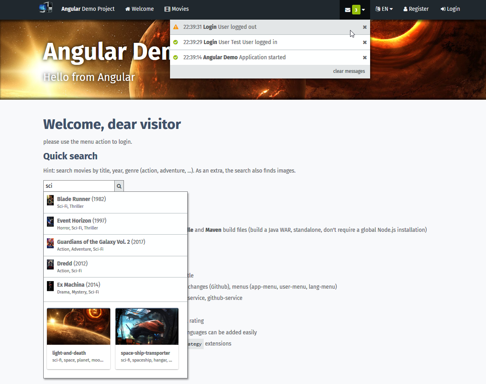

# Angular demo project
Demo project/showcase/template for Angular.



## Features
- **Angular 6** with **Typescript**
- **Build**: **Angular CLI / NPM** build, with supplemental **Gradle** and **Maven** build files (build a WAR, standalone, don't require a global Node.js installation)
- **Single page application** with menu and **routing**
- **Reactive forms** with **validation**
- **Title service** support: each route has its own window title
- **Components**: welcome, login, movie-list, movie-detail, changes (Github), menus (app-menu, user-menu, lang-menu)
- **Services**: application-service, translate-service, movie-service, github-service
- **Pipes**: comma-separated, translate
- **Widgets** (components): input-component, input-errors, rating
- **Localization** in EN and DE with JSON files, additional languages can be added easily
- **Extension Strategies**: `SearchService` with `SearchStrategy` extensions

## Setup (Node and Angular CLI)
This project requires Node.js for the build process (download 'latest' from https://nodejs.org).

Install node module dependencies:
```
npm install
```
Install Angular CLI on your system (run as admin user)
```
npm install -g @angular/cli
```

## Build / Run
Build and run local server (accessible on [http://localhost:4200](http://localhost:4200)):
```
npm run start
```
Build only (target folder: `./dist`):
```
npm run build
```

## Build / Bundle with Maven
The project also contains a **Maven** POM, allowing it to be built using the `maven-frontend-plugin` (which does not require Node or Gulp to be pre-installed on the system). This POM can be used as a template for Java/Angular web projects, and bundles the application as a WAR file in the target folder.
Usage:

    mvn
	
## Build / Bundle with Gradle
The project also contains a **Gradle** build descriptor, which (same as the Maven build) bundles the application as a WAR file.
Usage:

    gradle

## Notes

 - For keeping the Node modules/dependencies up-to-date, use [npm-check-updates](https://www.npmjs.com/package/npm-check-updates)
